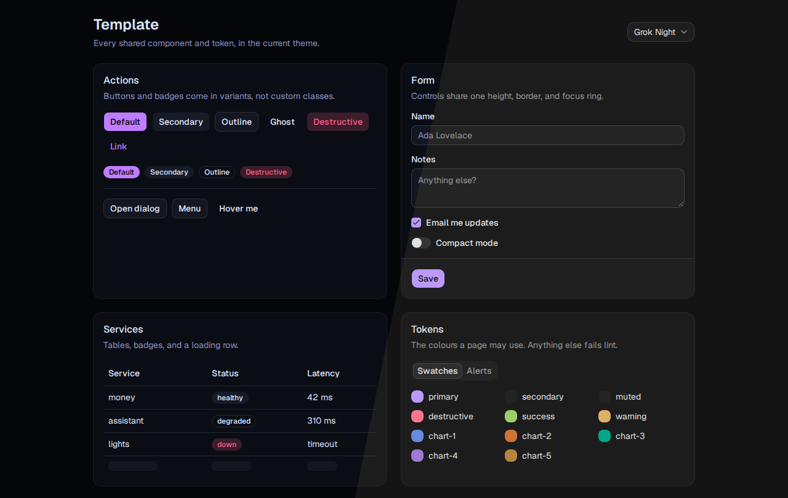

# @jacobragsdale/ui

One package that gives every web app the same look and the same guardrails: two swappable themes, shadcn/ui components (Base UI primitives), and strict TypeScript, ESLint, and Prettier configs. Apps install it from this repository, so a theme or component change ships to every app with `pnpm update`.



| Piece      | What an app gets                                                                                                                                                                                                                  |
| ---------- | --------------------------------------------------------------------------------------------------------------------------------------------------------------------------------------------------------------------------------- |
| Theme      | `styles.css`: Tailwind v4, the Neon Void and Grok Night token sets, Geist and JetBrains Mono.                                                                                                                                     |
| Components | 18 shadcn/ui components plus a theme switcher and `toast`.                                                                                                                                                                        |
| TypeScript | `tsconfig.json` with `strict` and every extra strictness flag, including `exactOptionalPropertyTypes` and `noUncheckedIndexedAccess`.                                                                                             |
| ESLint     | typescript-eslint `strictTypeChecked`, `@eslint-react` strict, jsx-a11y strict, unicorn, react-refresh, and all six [`@shadcn/lint`](https://github.com/shadcn-ui/lint) design-system rules, with explicit return types required. |
| Prettier   | Width 200, no trailing commas, collapsed objects.                                                                                                                                                                                 |

The rules for building pages with it are in [DESIGN.md](DESIGN.md).

## Start a new app

The [`template/`](template) directory is a Vite + React app already wired to the package. It doubles as the showcase in the screenshot above.

Prerequisites: Node.js 22.13 or later and pnpm 11.

1. Copy the template. The copy installs `@jacobragsdale/ui` from this public repository, so no token is needed:

   ```sh
   pnpm dlx tiged jacobragsdale/ui/template APP_NAME
   ```

2. In `APP_NAME/package.json`, change `"name"` from `template` to your app's name.
3. Install and start it:

   ```sh
   cd APP_NAME
   pnpm install
   pnpm dev
   ```

   Vite prints a local URL. The page shows every component, with a theme picker in the top-right corner.

4. Replace `src/app.tsx` with your app, keeping its exported `App` component, which `src/main.tsx` renders.

`APP_NAME` is the directory to create, such as `lights-web`.

Before committing, run the checks the template defines: `pnpm typecheck`, `pnpm lint`, `pnpm format:check`, and `pnpm build`.

## Add it to an existing app

This guide assumes a Vite + React 19 app with Tailwind v4 and pnpm.

1. Install the package:

   ```sh
   pnpm add "github:jacobragsdale/ui#semver:^1.0.0"
   ```

2. Replace the Tailwind entry stylesheet (usually `src/index.css`) with one import. It brings Tailwind, the fonts, and a `@source` for the package's components; the app keeps `tailwindcss` and `@tailwindcss/vite` in its own Vite config. Keep any app-specific `@theme` or `@utility` blocks after the import:

   ```css
   @import "@jacobragsdale/ui/styles.css";
   ```

3. Extend the shared TypeScript config in the tsconfig that covers `src` (`tsconfig.app.json` if the app splits its configs), keeping the app's own `types`, `paths`, and `include`:

   ```json
   { "extends": "@jacobragsdale/ui/tsconfig.json", "compilerOptions": { "types": ["vite/client"] }, "include": ["src", "vite.config.ts"] }
   ```

4. Replace `eslint.config.js` (or `.mjs`):

   ```js
   import { config } from "@jacobragsdale/ui/eslint";

   export default config(import.meta.dirname);
   ```

   To add app-specific rules, wrap it with `defineConfig` from `eslint/config`: `defineConfig(config(import.meta.dirname), { rules: { ... } })`. Remove the ESLint plugins the old config imported (such as `typescript-eslint` and `eslint-plugin-react-hooks`) from `package.json`; the package brings its own.

5. Point Prettier at the shared config by adding `"prettier": "@jacobragsdale/ui/prettier"` to `package.json` and deleting any other Prettier config file.
6. Apply the saved theme before the first render, in `src/main.tsx`:

   ```tsx
   import { initTheme } from "@jacobragsdale/ui/lib/theme";

   initTheme();
   ```

7. Change imports from the app's own shadcn copies (`@/components/ui/button`) to `@jacobragsdale/ui/components/ui/button`, then delete the local copies of every component the package has (`ls node_modules/@jacobragsdale/ui/src/components/ui`) and `components.json`. If app code calls `cn`, run `pnpm add cn` and import it with `import { cn } from "cn"` instead of the local helper.
8. Run `pnpm typecheck` and `pnpm lint`, and fix what they report. Most errors in an older app are missing return types and `className` overrides on components; [DESIGN.md](DESIGN.md) says what to use instead.

The migration is done when `pnpm typecheck`, `pnpm lint`, and `pnpm build` pass and `pnpm dev` shows the app in Neon Void.

## Pull a new release into an app

Apps depend on `github:jacobragsdale/ui#semver:^1.0.0`, so pnpm installs the newest `v1.x.y` tag and records its commit in the lockfile. To move an app to the latest release:

```sh
pnpm update @jacobragsdale/ui
```

Commit the changed `pnpm-lock.yaml`. A new major version (`v2.0.0`) is not picked up automatically; change `^1.0.0` in `package.json` to `^2.0.0` after reading what broke.

## Release a change

Work happens on `main` in this repository. CI runs the same checks as `pnpm typecheck && pnpm lint && pnpm format:check && pnpm test && pnpm build`.

To release, start from a clean `main` whose CI run passed:

1. Bump the version. Use `patch` for token tweaks and fixes, `minor` for new components, themes, or lint rules that existing apps already pass, and `major` for anything that makes an app fail to build or lint:

   ```sh
   pnpm version minor
   ```

   pnpm commits the new version and creates a `vX.Y.Z` tag.

2. Push the commit and the tag:

   ```sh
   git push --follow-tags
   ```

Apps receive the release the next time they run `pnpm update @jacobragsdale/ui`.

## Add a theme

1. In [`src/styles.css`](src/styles.css), copy the `[data-theme="grok-night"]` block, rename the selector to the new theme's id, and change the values. Keep every colour used for text (the `*-foreground` tokens, `primary`, `destructive`, `success`, `warning`) at 4.5:1 contrast or better against `background`, `card`, and `muted`; any WCAG contrast checker works.
2. In [`src/lib/theme.ts`](src/lib/theme.ts), add the id to `themes` with its label and `appearance` (`"light"` or `"dark"`; dark themes turn on the `dark:` variants that shadcn components use). `ThemeId`, `themeIds`, and the theme switcher pick it up from there.
3. Run `pnpm install` at the repository root, then `pnpm dev` in `template/`, and check the new theme in the picker. Inside this repository the template uses the local checkout, not the GitHub release.
4. [Release](#release-a-change) it as a `minor` version.

To change which theme apps start in, change `defaultTheme` in `src/lib/theme.ts` and move the `:root` selector in `styles.css` to that theme's block. An app can also pick its own default with `initTheme("grok-night")`. The default applies only until a visitor picks a theme; the choice is saved in `localStorage` per origin, so each app remembers its own.

## Add a shadcn component

At the repository root, run:

```sh
pnpm shadcn add COMPONENT
```

`COMPONENT` is a name from the [shadcn/ui component list](https://ui.shadcn.com/docs/components), such as `popover`. The CLI writes it to `src/components/ui/` and adds its dependencies, and apps import it as `@jacobragsdale/ui/components/ui/COMPONENT` with no export list to update. If `pnpm typecheck` then reports `Cannot find module` for a package the new file imports, `pnpm add` that package; the CLI missed `@base-ui/react` the first time.

Files in `src/components/ui/` stay as shadcn generates them: ESLint and Prettier skip them, and `tsc` still checks them. One file carries a local edit that `pnpm shadcn add --overwrite` would undo: `sonner.tsx` reads the theme from `#lib/theme` instead of `next-themes`.

## Reference

### Package exports

| Import                                        | Contents                                                                      |
| --------------------------------------------- | ----------------------------------------------------------------------------- |
| `@jacobragsdale/ui/styles.css`                | Tailwind, theme tokens, fonts, base styles. The app's only stylesheet import. |
| `@jacobragsdale/ui/components/ui/<name>`      | shadcn/ui components.                                                         |
| `@jacobragsdale/ui/components/theme-switcher` | `ThemeSwitcher`: a select that changes and saves the theme.                   |
| `@jacobragsdale/ui/lib/theme`                 | Theme runtime; see below.                                                     |
| `@jacobragsdale/ui/lib/toast`                 | `toast` from sonner, matching the `Toaster` in `components/ui/sonner`.        |
| `@jacobragsdale/ui/eslint`                    | `config(rootDir)`: the flat ESLint config.                                    |
| `@jacobragsdale/ui/prettier`                  | The Prettier config.                                                          |
| `@jacobragsdale/ui/tsconfig.json`             | The base TypeScript config for Vite + React.                                  |

The package ships TypeScript source, not compiled JavaScript. The app's Vite compiles it and the app's `tsc` checks it with the same strict config.

### Theme runtime (`lib/theme`)

| Export                 | Description                                                                                                    |
| ---------------------- | -------------------------------------------------------------------------------------------------------------- |
| `themes`               | Every theme id with its `label` and `appearance`.                                                              |
| `ThemeId`              | Union of theme ids: `"neon-void" \| "grok-night"`.                                                             |
| `themeIds`             | The ids as an array, in declaration order.                                                                     |
| `defaultTheme`         | `"neon-void"`.                                                                                                 |
| `initTheme(fallback?)` | Applies the theme saved in `localStorage`, or `fallback` (default `defaultTheme`). Call once before rendering. |
| `setTheme(id)`         | Applies a theme and saves it to `localStorage` under the key `theme`.                                          |
| `useTheme()`           | React hook returning the current `ThemeId`; re-renders when the theme changes.                                 |
| `isThemeId(value)`     | Type guard for untrusted values such as storage or select input.                                               |

A theme is applied by setting `data-theme` on `<html>` and toggling the `dark` class for dark themes.

## License

MIT
